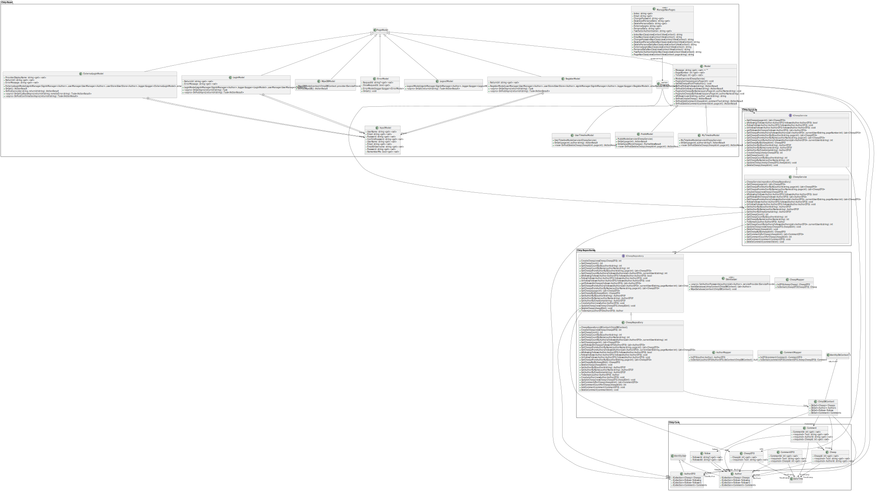

# Design and Architecture of _Chirp!_

## Domain model

Here comes a description of our domain model.
OK GOOD
(you may want to use a magnifying glass lol)


## Architecture — In the small (OK GOOD MAN)
OK GOOD

## Architecture of deployed application (OK GOOD MAN)
OK GOOD

## User activities (JOHN JOHN)

## Sequence of functionality/calls trough _Chirp!_ (BJØRN)
In this section we will detail how the flow of messages and data work in our chirp application.


# Process

## Build, test, release, and deployment (PHILLIP)

## Team work (ALEX)

The above image shows our project board on GitHub. We have used the project board to keep track of our progress and to assign tasks to each other.
The board is divided into four columns: Todo, In Progress, Under review, and Done. Each task is represented by a card that can be moved between the columns.
At the time of writing, we only have one task on the board which is yet to be completed (toggle light/dark mode). We do, however feel it would be nice to have features such as liking posts, so we might add that later.

Feature development workflow:

- Issue created with requirements
- Branch created from main
- Development and testing
- PR created with reviews
- CI checks run
- PR merged to main
- Deployment triggered

## How to make _Chirp!_ work locally (ALEX)

1. Clone the repository:

```bash
git clone https://github.com/ITU-BDSA2024-GROUP9/Chirp.git
cd Chirp
```

2. Set up development environment:

```bash
dotnet restore
```

3. Configure environment:

Create user secrets for GitHub OAuth
```bash
dotnet user-secrets init
dotnet user-secrets set "GITHUBCLIENTID" "YOUR_CLIENT_ID"
dotnet user-secrets set "GITHUBCLIENTSECRET" "YOUR_CLIENT_SECRET"
```

4. Run the application:


```bash
dotnet run --project src/Chirp.Razor
```

5. Access the application:

- Open browser to https://localhost:5273
- Default test accounts available

## How to run test suite locally (PHILLIP AND JONATHAN)

# Ethics (BJØRN)

## License (BJØRN)

## LLMs, ChatGPT, CoPilot, and others (PHILLIP)

For development, we used the following LLMs:
- Claude
- Microsoft Co-pilot
- OpenAI ChatGPT

- Descibe when and how it was applied

The LLMs listed above was primarily used for idea and concept generation. Each week, we received a list of requirements,
which we would have to fulfill before the next lecture. In cases where it was very precise what we had to do, the LLMs
would help us to troubleshoot and or to help us move forward if we got stuck. In other cases where the requirements were
broader, the LLMs enabled us to quickly gain a lot of knowledge on the area before we would start implementing. In short,
the LLMs helped us research and troubleshoot much faster than we would have been able to do, if we had to do Google searches
each time we had a question. This was extremely useful if we were stuck on something very specific.

- Reflect in which degree the responses of the LLM were helpful

The LLMs enabled us to get personalized help with troubleshooting or research, which helped us solve issues and gain
a greater understanding of the subject, compared to if we had to manually do this via Google. We did not have much success
with having the LLMs directly helping us with the code, since it more than often did not understand the context fully
for our Project.

- Discuss briefly how LLMs sped up development
