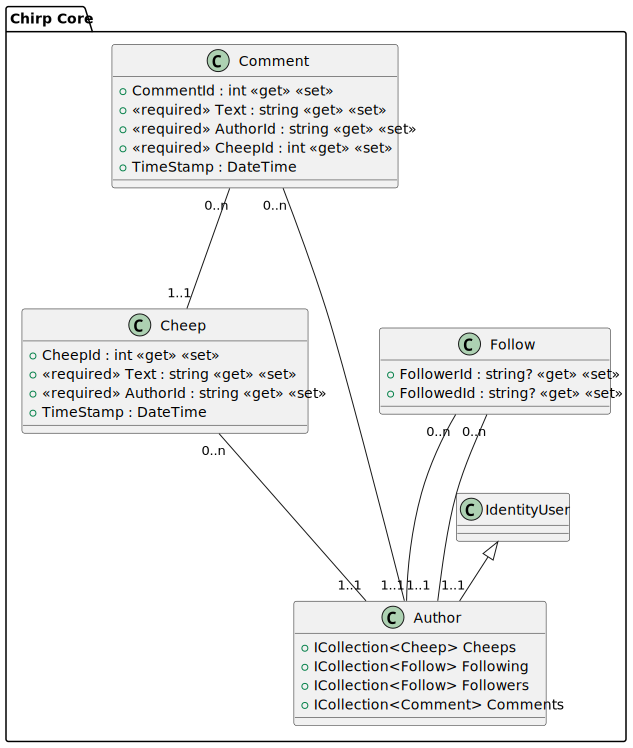
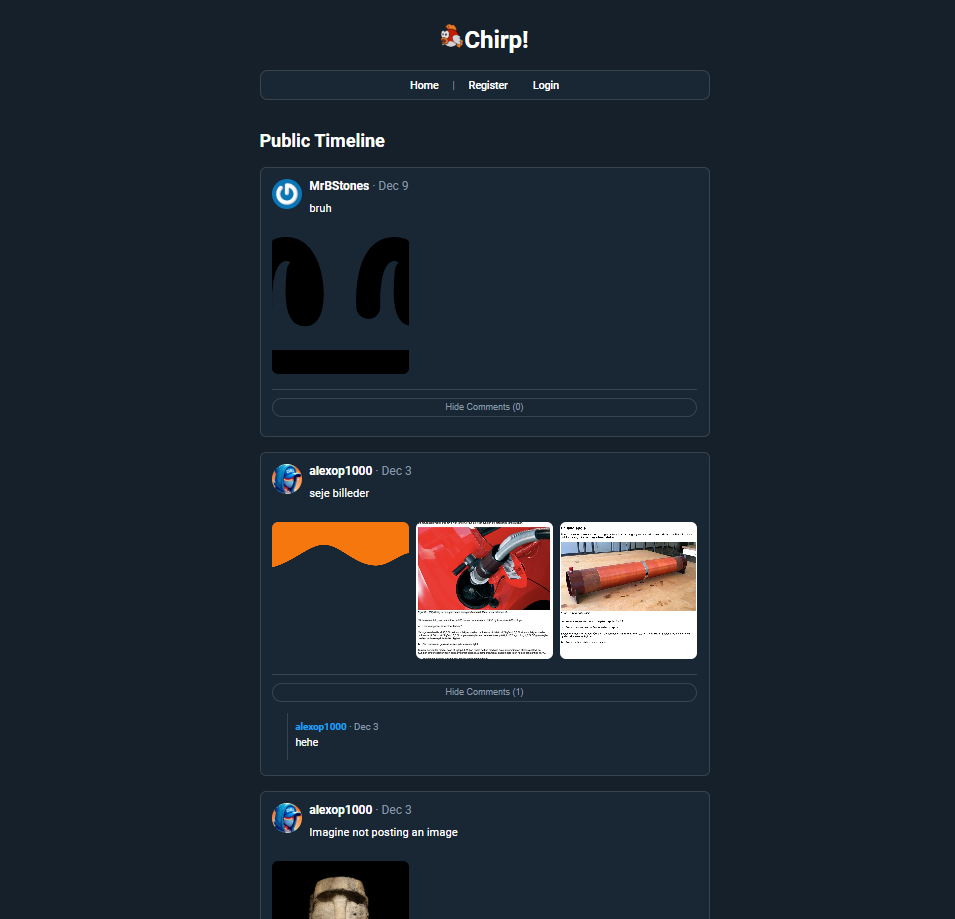
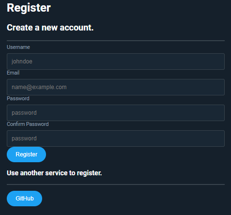
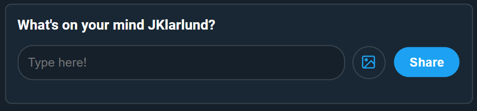
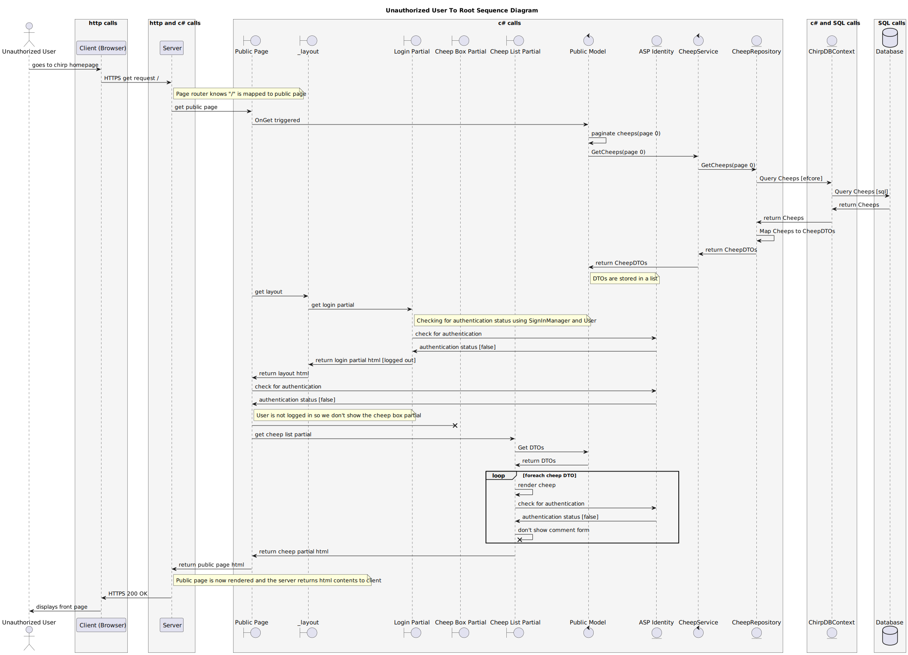

\pagebreak

# Design and Architecture of _Chirp!_
Below is a uml diagram of the entire chirp application:


[Uml image in HD](https://github.com/ITU-BDSA2024-GROUP9/Chirp/blob/e15431b1cc976af343166b0d297785bb711e7963/docs/images/include.svg)

## Domain model

The domain model of Chirp! is illustrated in the UML class diagram below. The model consists of four main entities: Author, Cheep, Comment, and Follow. The Cheep entity represents a post and contains information such as the cheep's content, time posted and the Author who posted it. The Comment entity represents a comment made on a cheep and contains information such as which Cheep the comment was made on.

The Author entity represents a user of the application which can have up-to many Cheeps, Comments, Followers and users they are Following. Furthermore, we use ASP.NET Identity with the Author entity inheriting the IndentityUser class which contains information such as the username, email, and password. The Follow entity represents a follow relationship between two Author entities. An Author has a list of Follow entities for their followers and the people they are following so this is represented in the UML as two bi-directional one to many relationships.



## Architecture — In the small

The architecture of Chirp! is based on the Onion Architecture. The Onion Architecture is a layered architecture that emphasizes separation of concerns and dependency inversion. We implement this by having the different layers encapsulated within their own .csproj projects. Our core layer contains our Domain model and DTO classes which are independent of the other layers with no external references. The next layer is our Repository Interface layer containing logic to interact with the database and has a reference to the core layer. The Service interface layer contains business logic interfacing with the repositories. Finally, our outer layers consist of the User Interface layer which contains the presentation logic of the application and interacts with the Service Interface layer to display the data to the user and receive input from the user. Our tests work on different layers, in addition to the UI tests, which is why the illustration shows the outer layer being split between UI and tests (with tests referencing the UI too).

We kept a more rigorous separation by not using the single Chirp.Infrastructure project to contain both our repository layer and services layer, because code in the same project with different namespaces can still reference each other. For example, a Chirp.Repositories class could've referenced a Chirp.Services class which would violate the onion architecture. By having separate projects, it prevents these violations from arising while also providing better encapsulation of the different layers.


## Architecture of deployed application

The architecture of the deployed Chirp! application is illustrated in the diagram below. The application is deployed to Azure App Service server via GitHub actions ci/cd pipeline and uses an SQLite .db file as the database stored on the server. The application is accessed by users through a web browser, which communicates with the application server over HTTPS. Additionally, the application server interacts with the database to retrieve and store data, and interacts with external services such as GitHub for OAuth authentication, while using Gravatar API for profile pictures.


## User activities
### 1. A Non-Authorized User Accessing the Website for the First Time

Upon entering the URL for our website, the user is presented with the Chirp logo and name. Slightly below that, the user will see a navigation bar containing a “Home” tab – which will redirect them to the public timeline, as well as “Register” and “Login” tabs.



Below the navigation bar, the public timeline starts. Here, cheeps from all users are displayed from newest to oldest. The unauthorized user can click on “Show Comments”, which will display all comments from newest to oldest. They can also click on authors or commenters to access their private timelines. Here, their individual cheeps are displayed, also from newest to oldest. If the user scrolls to the bottom of a private or public timeline, more cheeps will dynamically be loaded in.

If a user likes what they see, they can click on the “Register” tab and be redirected to our signup page. Here, a user can register normally with a username, email, and password (which they must confirm). They can also register with GitHub, which will redirect them to authorize with GitHub. Upon registering with either method, the user is automatically logged in and can set up their profile.



After signing up, the user can login in the "Login" tab in the navigation bar.


### 2. Authorized Users

Upon logging in, the user is able to post cheeps, follow other users, access their own timeline, and manage their account. The cheep post box is placed just below the navigation bar and is displayed on both private and public timelines. It contains a text field allowing the user to type 160 characters per cheep. The user can also add images by clicking the image icon, which will prompt the user to select an image from their filesystem. When the user is done composing their cheep, they simply click the share button to send the cheep.



A user can comment on any cheep, including their own, by clicking "Show Comments" and then writing a comment containing up to 160 characters.


Following another user is done by accessing the private timeline of the user and pressing the “Follow” button. This will add past and future posts to the follower’s private timeline.


An authorized user can also manage their account by clicking the “About Me” tab in the navigation bar. They can set up a profile picture by clicking the “Gravatar” tab and linking their Gravatar profile. They can change their password, email, and username (unless linking up with GitHub, then the username will be the same as on their GitHub profile). They can change their password in the password tab. Finally, they can click the “About Me” tab to see their personal data. Here, they can download a JSON file containing all knowledge the Chirp application has about them. They are also granted an overview of people they are following and cheeps they have posted, which they can view from the website.


If the user wants to delete their profile, they simply press the “Forget Me” button, which removes all their data – but also their profile – from the website and application.


## Sequence of functionality/calls trough _Chirp!_
In this section we will detail how the flow of messages and data work in our chirp application. Specifically for an unauthorized user that is trying to access the root of our application.



Key Points in the [Diagram](https://github.com/ITU-BDSA2024-GROUP9/Chirp/blob/e15431b1cc976af343166b0d297785bb711e7963/docs/images/sequence.svg):

**Authentication Checks**
We ensure that unauthorized users cannot access certain features (e.g., the cheep box or comment forms).

**Efficient Data Handling**
The sequence highlights how data is fetched, transformed into DTOs, and then used to render the page.

**Component Modularity**
The use of multiple components (Partials, Layout, etc.) to build the page ensures separation of concerns and maintainability.

**Data Flow**
Each type of call contributes to the flow of data from the database to the client.

The final outcome is a public homepage that adapts its content based on the user's authentication status, showing only the components and features intended for unauthorized users.

# Process

## Build, test, release, and deployment


The above UML activity diagram shows the process for the application being build, tested, released, and deployed for our
Chirp application using Github Actions. The process is triggered whenever new code is pushed to the repository.
- Build Stage
The workflow starts by building the application, which includes installing dependencies and compiling the code. If the
build fails, the workflows stops, and no further actions are performed.
- Test Stage
If the build is successful, the workflow will run automated test (unit tests, integration tests, UI tests, and E2E test).
If any of the tests fail, the workflow will end.
- Release Stage
If all the tests succeed, the workflow will check if the commit contains a tag. If a tag is detected, it will automatically
create a release.
- Deployment Stage
After release (Both if tag is present or not), the application will be deployed to production.

This workflow ensures a structured and automated pipeline, that catches failure and only allows stable versions to be
deployed. This significantly reduces manual effort and increases reliability during development process.

## Team work


The above image shows our project board on GitHub. We have used the project board to keep track of our progress and to assign tasks.
The board is divided into four columns: Todo, In Progress, Under review, and Done. Each task is represented by a card that can be moved between the columns.
At the time of writing, we only have one task on the board which is yet to be completed (toggle light/dark mode). We do, however, feel it would be nice to have features such as liking posts, so we might add that later.

Feature development workflow:

- Issue created with requirements
- Branch created from main
- Development and testing
- PR created with reviews
- CI checks run
- PR merged to main
- Deployment triggered

## How to make _Chirp!_ work locally

1. Clone the repository:

```bash
git clone https://github.com/ITU-BDSA2024-GROUP9/Chirp.git
cd Chirp
```

2. Set up development environment:

```bash
dotnet restore
```

3. Configure environment:

Create user secrets for GitHub OAuth
```bash
dotnet user-secrets init
dotnet user-secrets set "GITHUBCLIENTID" "YOUR_CLIENT_ID"
dotnet user-secrets set "GITHUBCLIENTSECRET" "YOUR_CLIENT_SECRET"
```

4. Run the application:


```bash
dotnet run --project src/Chirp.Razor
```

5. Access the application:

- Open browser to https://localhost:5273
- Default test accounts available

## How to run test suite locally
### Guide on running the test suite

To run all tests for our Chirp project, please follow the steps below:

1. Clone the project from GitHub.
2. From your terminal, navigate to the test folder located at `/test/Chirp.Tests`.
3. Run the command `dotnet test` and await the results.

### Brief description of testing
#### Unit Testing

We have unit tests on the repository and service layers of the application. These tests ensure that the individual components
of our application (I.e. functions, classes, and methods) behave as expected in isolation. We have achieved approximately
100% test coverage in these layers, which provides confidence that the processes are working correctly under isolated conditions.

#### End-to-End (E2E) Testing

The E2E test verifies the core user journey in the Chirp application. It simulates user actions such as registration,
login, posting a cheep, and following/unfollowing a user. The test ensures the UI, service layer, and database work
together correctly by asserting that data appears as expected in both the interface and the database.

#### UI Testing
Our UI tests aim to verify that the user interface is functioning as intended. 
The tests cover core functionality, asserting that a user can register, login, post cheeps, access timelines, etc. as intended. 
The tests are made using Playwright and use the NUnit test suite, as this allowed the group to use the Playwright test-generation tool.
#### Integration Testing

Integration tests verify that different components of the Chirp application (e.g. endpoints, database) work together correctly.
Using HttpClient and test-specific SQLite database we:
- Test endpoints like the homepage and user timelines to ensure they return successful responses (HTTP 200).
- Validate that pages display correct content, such as user-specific timeline and a maximum of 32 posts per page.
These tests ensure the application functions as expected when components interact.

# Ethics
## License
For our Chirp application, we have chosen to release the project under The Unlicense.

The Unlicense is a public domain dedication that allows anyone to use, modify, and distribute the work we have created, freely and without restriction. This permission extends to all purposes, whether private or commercial. Essentially, we have surrendered our code to the public domain, making it accessible to everyone without requiring attribution or compliance with traditional licensing terms.

We selected The Unlicense because this project was developed primarily for learning purposes. As such, we believe it is not necessary to protect it with a more formal or restrictive license. By choosing this approach, we hope others can freely learn from, build upon, or adapt our work without any barriers. Perhaps our project can even help the next generation of ITU students.

See https://unlicense.org/ for more details about the license.

## LLMs, ChatGPT, CoPilot, and others

During the development of our project, we utilized the following Large Language Models (LLMs):
- Claude
- Microsoft Co-pilot
- OpenAI ChatGPT

### Application of LLMs in Development

The LLMs listed above primarily served as tools for idea and concept generation.
Each week, we were given a list of requirements to complete before the next lecture. When the requirements were precise
and clearly defined, the LLMs played a valuable role in helping us troubleshoot issues or overcome roadblocks.
On the other hand, when requirements were broader or open-ended, the LLMs allowed us to quickly acquire knowledge in the
relevant areas, enabling us to proceed with implementation more confidently.

By acting as a research and troubleshoot assistant, the LLMs significantly reduced the time we would otherwise have spent
doing traditional searches online. This was particularly useful for resolving highly specific challenges, where the efficiency
and personalized responses from the LLMs saved us considerable effort.

### Reflection on the Helpfulness of LLM responses

The responses provided by the LLMs were highly beneficial for research and troubleshooting, offering us personalized guidance
that gave a better understanding of the subject. This approach proved more effective than manually going through generalized
search engine results, as the LLMs offered targeted answers specific to our queries. 

However, we found that the LLMs were less effective for directly assisting with coding. While they provided general guidance
and suggestions, they often struggled to fully grasp the context of our project, making it difficult to rely on them for
specific code solutions. Despite this limitation, their overall assistance made it easier for us to progress and quickly
gain necessary information.

### Impact on the development speed

The use of LLMs accelerated our development process. By offering immediate, personalized responses to our questions,
the LLMs allowed to skip prolonged searches through forums or articles. Traditional internet resources often present 
solutions to similar but not identical problems, whereas the LLMs helped us cut through ambiguity and quickly address our
specific issues. This efficiency proved especially beneficial in tight deadlines, enabling us to maintain momentum throughout the project.

It’s important to emphasize that the LLMs served purely as tools to enhance our workflow. 
They supported us in gaining clarity and overcoming challenges but unless directly stated in commit did not perform any of the actual work. 
The decisions, coding, and implementation were entirely our own, with the LLMs serving as an aid to improve efficiency and understanding.

